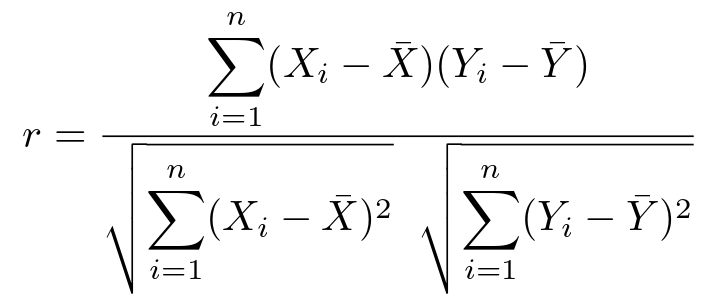

# Exploring Factors Affecting Extramarital Affairs

An exploratory data analysis project to determine which factors may influence extramarital affairs. The project uses Python, Pandas, Matplotlib, and Jupyter notebooks to explore the dataset, clean the data, and uncover patterns and insights.

# About the Dataset

The dataset was obtained from Kaggle under "Fair's Extramarital Affairs Data"

Singh, U. (2023). *Fairs Extramarital Affairs Data* [Data set]. Kaggle. https://www.kaggle.com/datasets/utkarshx27/fairs-extramarital-affairs-data

| Variable          | Description                                                                                                                                                                                                   |
| ----------------- | ------------------------------------------------------------------------------------------------------------------------------------------------------------------------------------------------------------- |
| **affairs**       | How often engaged in extramarital sexual intercourse during the past year?                                                                                                                                    |
| **happiness**     | Self-reported happiness level (higher = happier)                                                                                                                                                              |
| **yearsmarried**  | Number of years married. Coding: 0.125 = 3 months or less, 0.417 = 4–6 months, 0.75 = 6 months–1 year, 1.5 = 1–2 years, 4 = 3–5 years, 7 = 6–8 years, 10 = 9–11 years, 15 = 12 or more years.                 |
| **religiousness** | Religiousness level. Coding: 1 = anti, 2 = not at all, 3 = slightly, 4 = somewhat, 5 = very.                                                                                                                  |
| **age**           | Age in years. Coding: 17.5 = under 20, 22 = 20–24, 27 = 25–29, 32 = 30–34, 37 = 35–39, 42 = 40–44, 47 = 45–49, 52 = 50–54, 57 = 55 or over.                                                                   |
| **occupation**    | Occupation according to Hollingshead classification (reverse numbering)                                                                                                                                       |
| **education**     | Level of education. Coding: 9 = grade school, 12 = high school graduate, 14 = some college, 16 = college graduate, 17 = some graduate work, 18 = master's degree, 20 = Ph.D., M.D., or other advanced degree. |

# Correlation and Direction

Correlation shows how strongly and in what direction two variables are related. In this project, the Pearson correlation coefficient was used with the following formula:

to measure how each feature relates to the likelihood of extramarital affairs. Positive correlations indicate that higher values of a feature are associated with a higher likelihood of affairs, while negative correlations indicate the opposite. The table below summarizes the absolute correlation values and their directions for each feature considered in the analysis.

The table below presents the absolute correlation values and their directions for each feature considered in the analysis, providing a clear view of which factors are most strongly associated with extramarital behavior.

| Feature       | abs_correlation | Effect   |
|---------------|----------------|----------|
| happiness     | 0.279512       | negative |
| yearsmarried  | 0.186842       | positive |
| religiousness | 0.144501       | negative |
| age           | 0.095237       | positive |
| occupation    | 0.049612       | positive |
| education     | 0.002437       | negative |

# The Correlation Plot

The correlation plot provides a visual summary of how each feature is associated with the likelihood of extramarital affairs. By plotting the absolute correlation values for features such as happiness, years married, religiousness, age, occupation, and education, we can quickly identify which factors have the strongest linear relationships with affairs. Positive correlations indicate that higher values of a feature are associated with a higher likelihood of affairs, while negative correlations indicate the opposite. The plot allows us to visually compare the strength and direction of each relationship, highlighting the most influential factors at a glance and providing insight into patterns that may not be immediately evident from the raw data alone.

# The Findings

Based on the exploratory analysis of the Fair’s Affairs Dataset, several factors were examined for their association with the likelihood of extramarital affairs. The strongest relationships were observed with happiness (negative) and years married (positive), suggesting that lower happiness and longer marriages led to a higher likelihood of engaging in extramarital affairs. Religiousness also had a negative effect suggesting that more religious people tend to be faithful. Age, on the other hand, showed moderate (positive) influence, while occupation and education had minimal effect. Overall, the analysis highlights that personal satisfaction and marital duration are key factors associated with extramarital behavior.