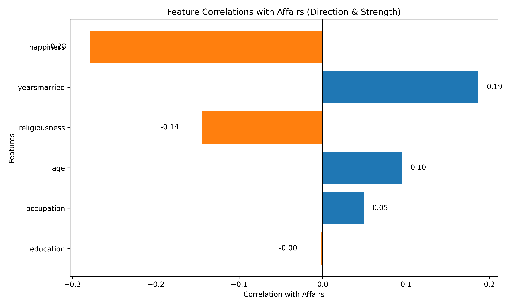

# Exploring Factors Affecting Extramarital Affairs

An exploratory data analysis project to determine which factors may influence extramarital affairs. The project uses Python, pandas, and Jupyter notebooks to explore the dataset, clean the data, and uncover patterns and insights.

# The Correlation Plot

